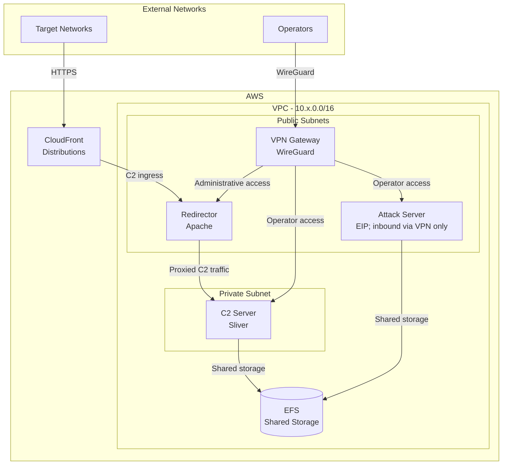

# Straylight Deployer

Automated red team infrastructure deployer for AWS. Deploys a production-ready C2 stack using Terraform (IaC) and Ansible (configuration over SSM) with zero manual post-deploy steps.

## Features

- **Infrastructure as Code**: Terraform deploys VPC, subnets, security groups, and instances.
- **Sliver C2**: Single-binary C2 framework with HTTP and mTLS listeners, operator config delivered to S3.
- **C2 Redirectors**: Apache with User-Agent-gated `.htaccess` rules and SSL termination.
- **WireGuard VPN**: Automated server setup with operator configs in S3.
- **Attack Server**: Baseline host provisioned for operator tooling.
- **Shared Storage**: EFS mounted across C2 and attack infrastructure.
- **Dynamic IP Resolution**: Terraform → Deployer → Ansible → Configuration.
- **Security Hardening**: Automated system updates, SSH/WireGuard/Apache configuration.
- **Centralized Logging**: CloudWatch Agent ships Apache access/error logs to CloudWatch Logs.
- **Operation Tagging**: Multi-operation support with proper resource isolation.
- **CloudFront Domain Fronting**: Optional — creates random-subdomain Route53 record under your domain, routes CloudFront → redirector.

## Quick Start

### Prerequisites

Install these system tools before setting up the project:

- [uv](https://docs.astral.sh/uv/getting-started/installation/) — manages Python and project dependencies
- [Terraform](https://developer.hashicorp.com/terraform/install) 1.0 or newer
- [AWS CLI](https://docs.aws.amazon.com/cli/latest/userguide/getting-started-install.html) v2
- [AWS Session Manager Plugin](https://docs.aws.amazon.com/systems-manager/latest/userguide/session-manager-working-with-install-plugin.html)
- Git

Python 3.12 is pinned in `.python-version`; uv installs it when needed. Python
3.13 is intentionally excluded because of an SSM libsodium crash on macOS.

### 1. Clone and Setup
```bash
git clone <your-fork>
cd straylight-deployer

uv sync --locked
uv run --locked ansible-galaxy collection install -r ansible/requirements.yml
```

These commands are the same on Linux and macOS. The deployer also upgrades the
declared Ansible Galaxy collections before it runs the playbooks.

### 2. Configure AWS Credentials
```bash
# Short-lived credentials (recommended)
export AWS_ACCESS_KEY_ID="AKIA..."
export AWS_SECRET_ACCESS_KEY="..."
export AWS_SESSION_TOKEN="..."

# Or profile
aws configure --profile myprofile
export AWS_PROFILE=myprofile
```

### 3. Deploy
```bash
uv run --locked python deployer.py
```

Deployer prompts for:
- **AWS Region** (default: `eu-west-1`)
- **Operation Name** — unique identifier, lowercase/underscores (e.g. `iron_sentinel`, `silent_bastion`, `northern_lance`)
- **VPC CIDR** — second octet for `10.x.0.0/16`
- **CloudFront count** — `0` to disable, `1-25` for domain fronting
- **Route53 domain** — your hosted zone (e.g. `example.com`) — only prompted if CloudFront enabled

### 4. Access Infrastructure

**VPN:**
```bash
aws s3 cp s3://{bucket}/wireguard/operator-configs-{operation}.tar.gz .
tar xzf operator-configs-{operation}.tar.gz
# Import operator-1.conf through operator-5.conf into WireGuard
```

**Sliver C2** (first boot — run once via SSM on C2 instance):
```
sudo sliver-client
  http --lhost 0.0.0.0 --lport 8888
  mtls --lhost 0.0.0.0 --lport 4444
  c2profiles export -n default -f /tmp/default.json
  exit

jq '.implant_config.user_agent = "<configured-user-agent>"' \
  /tmp/default.json > /tmp/straylight.json

sudo sliver-client
  c2profiles import -n straylight -f /tmp/straylight.json
  exit
```

Replace `<configured-user-agent>` with `c2_implant_ua` from
`ansible/group_vars/all.yml`.

Listeners and profile persist to SQLite — survive all reboots automatically.

**Operator config:**
```bash
aws s3 cp s3://{bucket}/sliver/operator-{operation}.cfg ./operator.cfg
sliver-client import ./operator.cfg
sliver-client  # connects to C2 via WireGuard
```

**Generate beacon:**
```
generate beacon --http https://{cloudfront-domain} --c2profile straylight --os darwin --arch arm64
```

## Architecture

### Network and Traffic Flow

The diagram is organized by trust boundary and separates the two primary paths:
implant traffic enters through CloudFront and the redirector, while operator traffic
enters through WireGuard.



### Server Roles

| Server | Purpose | Network | Instance |
|--------|---------|---------|----------|
| VPN | WireGuard operator access | Public IP | t3.micro |
| Redirector | Apache proxy for C2 traffic | Public IP | t3.micro |
| C2 | Sliver C2 server | Private IP (VPN only) | t3.medium |
| Attack | Operator tooling host; inbound access restricted to VPN subnet | Public subnet with EIP | t3.micro |

### Port Layout (Sliver)

| Port | Protocol | From | Purpose |
|------|----------|------|---------|
| 8888 | TCP | Redirector subnet | Sliver HTTP C2 listener |
| 4444 | TCP | VPN subnet | Sliver mTLS listener |
| 31337 | TCP | VPN subnet | Sliver operator gRPC |
| 443 | TCP | CloudFront origin network | Redirector HTTPS |
| 51820 | UDP | Internet | WireGuard VPN |

## Project Structure

```
straylight-deployer/
├── .python-version          # Python version used by uv
├── deployer.py              # Main orchestrator
├── pyproject.toml           # Project metadata and dependency constraints
├── uv.lock                  # Reproducible dependency lockfile
├── terraform/               # Infrastructure as Code
│   ├── main.tf
│   ├── outputs.tf
│   ├── variables.tf
│   ├── ssm-bootstrap.sh     # EC2 user-data (SSM agent only)
│   └── modules/
│       ├── cdn/             # CloudFront, Route53, ACM
│       ├── compute/         # EC2 instances
│       ├── networking/      # VPC, subnets, NAT, endpoints
│       ├── security/        # Security groups, IAM roles
│       └── storage/         # EFS, S3, CloudWatch logs
└── ansible/
    ├── site.yml             # Main playbook orchestrator
    ├── base-hardening.yml
    ├── vpn-wireguard.yml
    ├── redirector-apache.yml
    ├── c2-sliver.yml        # Sliver C2 provisioning
    ├── attack-server.yml
    ├── efs-mount.yml
    ├── group_vars/
    ├── templates/
    └── files/
        └── c2-assets/       # Gitignored
```

## Manual Usage

### Terraform Only
```bash
cd terraform/
terraform init
terraform plan
terraform apply
```

### Ansible Only
```bash
export AWS_DEFAULT_REGION=eu-west-1
export OPERATION_NAME=<operation_name>
export TERRAFORM_S3_BUCKET=<bucket>

uv run --locked ansible-playbook ansible/site.yml -i ansible/aws_ec2.yml
uv run --locked ansible-playbook ansible/c2-sliver.yml -i ansible/aws_ec2.yml
uv run --locked ansible-playbook ansible/redirector-apache.yml -i ansible/aws_ec2.yml --limit redirector_servers
uv run --locked ansible all -m ping -i ansible/aws_ec2.yml
```

## Troubleshooting

**Terraform state issues:**
```bash
cd terraform/
rm -rf .terraform terraform.tfstate*
terraform init
```

**Ansible SSM connection failures:**
```bash
uv run --locked ansible all -m ping -i ansible/aws_ec2.yml
aws ec2 describe-instances --filters "Name=tag:Operation,Values=<op>"
```

**Private subnet apt failures:**
`base-hardening.yml` runs first with retries — NAT Gateway may not be ready immediately after Terraform completes.

**Debug:**
```bash
TF_LOG=DEBUG uv run --locked python deployer.py
uv run --locked ansible-playbook ansible/site.yml -i ansible/aws_ec2.yml -vvv
```

## Security Considerations

- Use short-lived AWS credentials with MFA.
- `terraform.tfstate` contains infrastructure details — treat the S3 state bucket as sensitive.
- Operator WireGuard and Sliver configs in S3 — download, distribute securely, rotate after ops.
- Apache logs ship to CloudWatch (`/aws/ec2/{operation}/apache`) — plan log group cleanup.
- All EBS volumes encrypted at rest. SSM Parameter Store values KMS-encrypted.
- Never commit `.terraform/`, `terraform.tfstate*`, or anything under `ansible/files/`.

## Reference

**Straylight** is named after Villa Straylight, the Tessier-Ashpool stronghold in William Gibson's *Neuromancer*.
